# EmbodiedScan RGB-D Observation to 3D BBox Feasibility Report

Date: 2026-04-25  
Repository: `/home/ysh/codecase/3DVLMReasoning`  
Report package: `docs/10_experiment_log/embodiedscan_3d_bbox_feasibility_report/`

This document summarizes the feasibility study for obtaining 3D bounding boxes from EmbodiedScan RGB-D observations for visual grounding. It focuses only on whether each candidate route can produce useful 3D bbox proposals. It does not evaluate downstream VLM reasoning, answer generation, or final language-conditioned disambiguation.

## Executive Summary

The main conclusion is that the most reliable 3D detector route is:

```text
camera pose -> recover ScanNet scene id -> run V-DETR on full raw ScanNet scene mesh
```

This route is much stronger than running a 3D detector on a single-frame or few-frame RGB-D reconstruction. On the batch30 experiment, full-scene V-DETR reaches Acc@0.25 `0.9333` and Acc@0.50 `0.6667`, while single-frame RGB-D backprojection reaches only Acc@0.25 `0.2667` and Acc@0.50 `0.0667`.

The practical recommendation is:

```text
Use full-scene V-DETR as the main 3D proposal generator when the ScanNet scene can be recovered.
Use 2D evidence, visibility, and language matching to select among full-scene proposals.
Keep 2D-CG / 2D-mask backprojection as a high-recall fallback, especially for open-world or detector-OOD classes.
Do not use single RGB-D frame point clouds as the primary input to V-DETR.
```

The important nuance is that "higher quality local raw mesh points" are not enough by themselves. The `scannet_pose_crop` route uses raw ScanNet mesh points rather than noisy RGB-D reconstruction points, but still underperforms full-scene V-DETR. This suggests the core bottleneck is not only point quality; it is also the detector's train-test distribution. V-DETR expects ScanNet-like complete scene point clouds with room context and object extents. Local crops and single-view partial clouds violate that assumption.

## Visual Summary

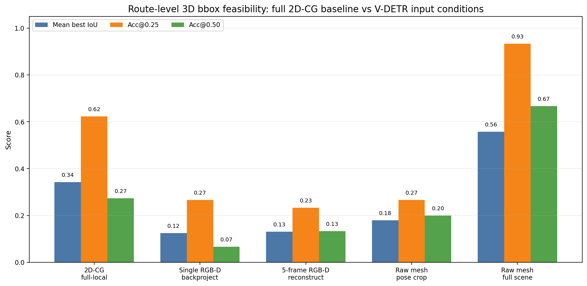

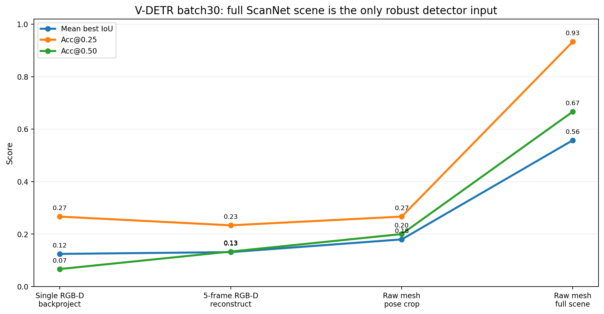

The strongest measured route is full-scene V-DETR. The full-local 2D-CG baseline has lower Acc@0.50 but useful broad coverage. The single-frame and multi-frame V-DETR routes are weak on the larger batch.

## Candidate Routes

### Route A: 2D Detection / Segmentation to 3D Proposals

This route keeps the existing 2D detection / segmentation pipeline and lifts observations into 3D using depth, camera pose, ConceptGraph-style accumulated objects, or 3D fitting.

Input:

- RGB-D observations
- camera intrinsics and poses
- 2D detection / segmentation outputs
- ConceptGraph prepared scene assets

Output:

- 3D proposals derived from 2D evidence and accumulated 3D object points

Strengths:

- Works for broader, open-world visual categories than ScanNet-class 3D detectors.
- Uses exactly the observation evidence seen by the downstream visual grounding task.
- Already gives useful recall over the full local target set.

Weaknesses:

- Boxes are often approximate.
- Over-merge and fragmentation can reduce Acc@0.50.
- Quality depends heavily on mask quality, depth quality, and object aggregation.

Measured result:

| Experiment | Targets | Mean IoU | Median IoU | Acc@0.25 | Acc@0.50 |
|---|---:|---:|---:|---:|---:|
| 2D-CG full-local | 2096 | 0.3429 | 0.3421 | 0.6226 | 0.2739 |

Interpretation:

This is a viable high-recall baseline. It is not a precise 3D detector, but it is hard to ignore because it covers many targets outside the closed ScanNet detector label set.

### Route B: Single RGB-D Frame Backprojection to V-DETR

This route takes one RGB-D frame, backprojects valid depth pixels into a point cloud using intrinsics, transforms points into the world/aligned frame using camera pose, and runs V-DETR on the resulting partial point cloud.

Input:

- one RGB-D frame
- camera intrinsics
- camera pose
- V-DETR ScanNet checkpoint

Output:

- V-DETR 3D bbox proposals from the single-frame point cloud

Measured result on batch30:

| Condition | Targets | Mean IoU | Median IoU | Acc@0.25 | Acc@0.50 |
|---|---:|---:|---:|---:|---:|
| single_frame_recon | 30 | 0.1244 | 0.0000 | 0.2667 | 0.0667 |

Interpretation:

This is not reliable enough to be the main 3D bbox route. The point cloud is too partial: it contains only visible surfaces, often no back side, incomplete object extents, and little room context. Even if the target is visible in the image, V-DETR does not consistently infer a good full 3D box from that partial geometry.

### Route C: Multi-frame RGB-D Reconstruction to V-DETR

This route reconstructs a point cloud from a small window of frames around the target's visible frame and runs V-DETR on the combined cloud.

Input:

- 5 RGB-D frames in the current batch
- camera intrinsics and poses
- V-DETR ScanNet checkpoint

Output:

- V-DETR proposals from the small reconstructed point cloud

Measured result on batch30:

| Condition | Targets | Mean IoU | Median IoU | Acc@0.25 | Acc@0.50 |
|---|---:|---:|---:|---:|---:|
| multi_frame_recon | 30 | 0.1312 | 0.0008 | 0.2333 | 0.1333 |

Interpretation:

Five frames are not enough to close the distribution gap. Multi-frame reconstruction improves some targets but still behaves like a partial local point cloud rather than a ScanNet-style complete scene.

This route should not be abandoned entirely, but it should be downgraded to an ablation path:

- test 10 / 20 / all visible frames
- test TSDF or voxel fusion
- test whether better point fusion closes the gap

It should not be the default route until those ablations show a large improvement.

### Route D: Camera Pose Local Raw ScanNet Mesh Crop to V-DETR

This route uses camera pose to recover the corresponding region from the original ScanNet mesh, then runs V-DETR on that local raw mesh point cloud. This is close to the user's proposed question:

```text
Given one image's camera information, crop the corresponding part from the original scene, then run 3D detection.
```

The current implementation is `scannet_pose_crop`. It uses the selected visible-frame camera poses and crops raw ScanNet mesh vertices by pose bounds with padding. It is not yet a precise full frustum crop, but it is already a higher-quality raw-mesh local crop than RGB-D reconstruction.

Measured result on batch30:

| Condition | Targets | Mean IoU | Median IoU | Acc@0.25 | Acc@0.50 |
|---|---:|---:|---:|---:|---:|
| scannet_pose_crop | 30 | 0.1797 | 0.0000 | 0.2667 | 0.2000 |

Interpretation:

Raw mesh local crop is better than single-frame RGB-D backprojection at Acc@0.50, but it is still far weaker than full-scene V-DETR. This suggests the limiting factor is not just noisy reconstructed points. The local crop still lacks full scene context and may remove geometric cues V-DETR expects.

This route deserves one more targeted experiment:

```text
single image intrinsic + pose -> project full ScanNet mesh into the camera
keep points inside the exact image frustum
optionally restrict to a 2D detection box or mask
compare:
  frustum_full_image + V-DETR
  frustum_2d_box + V-DETR
  frustum_2d_mask + direct 3D bbox fitting
```

My current expectation is:

- exact frustum crop may improve over pose-bounds crop
- 2D-mask guided geometric fitting may outperform V-DETR on local crops
- full-scene V-DETR will likely remain the best detector proposal route

### Route E: Full ScanNet Scene Mesh to V-DETR

This route uses the original ScanNet mesh for the whole scene, axis-aligns it into the EmbodiedScan coordinate frame, downsamples it, and runs V-DETR once per scene.

Input:

- full raw ScanNet scene mesh
- EmbodiedScan / ScanNet axis alignment
- V-DETR ScanNet checkpoint

Output:

- scene-level V-DETR 3D proposals

Measured result on batch30:

| Condition | Targets | Mean IoU | Median IoU | Acc@0.25 | Acc@0.50 |
|---|---:|---:|---:|---:|---:|
| scannet_full | 30 | 0.5576 | 0.5841 | 0.9333 | 0.6667 |

Interpretation:

This is the strongest route tested so far. It is also computationally attractive because V-DETR can be run once per scene and cached. If there are multiple visual grounding targets in the same scene, they can all reuse the same detector proposal set.

The main weakness is category coverage. V-DETR is trained on ScanNet-style classes. It can work well for desk, chair, table, window, sink, and door in this batch, but weak classes such as picture and some curtain/cabinet cases still need fallback logic.

## Experimental Setup

### Data

The experiments use EmbodiedScan validation data filtered to ScanNet-source samples. The local target set contains:

- `2096` deduplicated targets for the 2D-CG full-local evaluation
- `30` selected targets in the V-DETR batch30 experiment
- `10` ScanNet scenes in the V-DETR batch30 experiment

The batch30 subset was selected to focus on V-DETR / ScanNet overlapping classes with visible frames. This avoids evaluating V-DETR on categories it is not designed to detect.

Batch30 categories:

| Category | Count |
|---|---:|
| cabinet | 4 |
| chair | 3 |
| curtain | 6 |
| desk | 6 |
| door | 2 |
| picture | 1 |
| sink | 2 |
| table | 2 |
| window | 4 |

### Detector

The 3D detector route uses V-DETR with the ScanNet checkpoint:

```text
external/V-DETR/checkpoints/scannet_540ep.pth
```

The exported V-DETR box corners require a coordinate-frame conversion before evaluation. The bug found during this study was:

```text
V-DETR box_corners are in camera frame.
EmbodiedScan evaluation expects depth / aligned scene frame.
Required inverse transform: camera [x, y, z] -> depth [x, z, -y].
```

Before this fix, the V-DETR metrics were near zero despite visually plausible detections. After the fix, the pilot full-scene result jumped to mean IoU `0.8613` on 3 class-overlap targets.

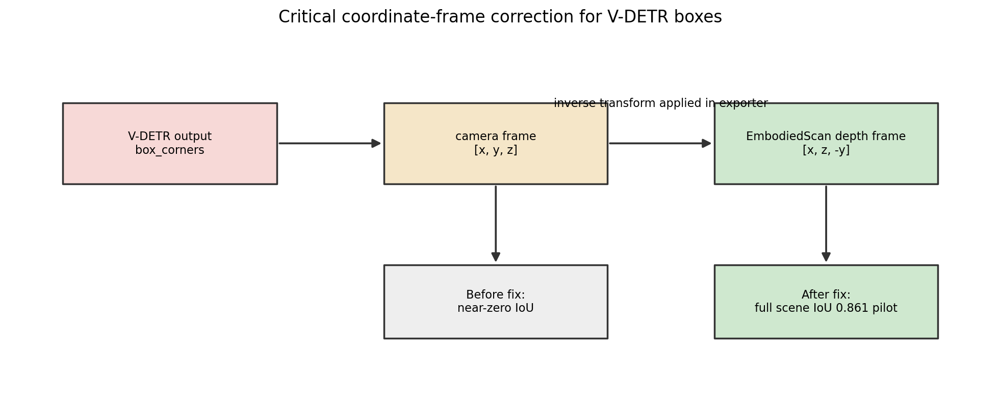

### Metrics

Each target is evaluated against all proposals for its route and condition. The report uses:

- mean best IoU
- median best IoU
- Acc@0.25
- Acc@0.50
- mean proposals per record
- per-class mean IoU
- target-level best-IoU heatmaps

The main metric for feasibility is Acc@0.25, because for visual grounding and proposal generation a loose but target-overlapping 3D box is useful. Acc@0.50 is used as a stricter localization quality signal.

## Main Results

### Route-level comparison

| Route / condition | Targets | Mean IoU | Median IoU | Acc@0.25 | Acc@0.50 |
|---|---:|---:|---:|---:|---:|
| 2D-CG full-local | 2096 | 0.3429 | 0.3421 | 0.6226 | 0.2739 |
| V-DETR single RGB-D backprojection | 30 | 0.1244 | 0.0000 | 0.2667 | 0.0667 |
| V-DETR 5-frame RGB-D reconstruction | 30 | 0.1312 | 0.0008 | 0.2333 | 0.1333 |
| V-DETR raw mesh pose crop | 30 | 0.1797 | 0.0000 | 0.2667 | 0.2000 |
| V-DETR full raw ScanNet scene | 30 | 0.5576 | 0.5841 | 0.9333 | 0.6667 |

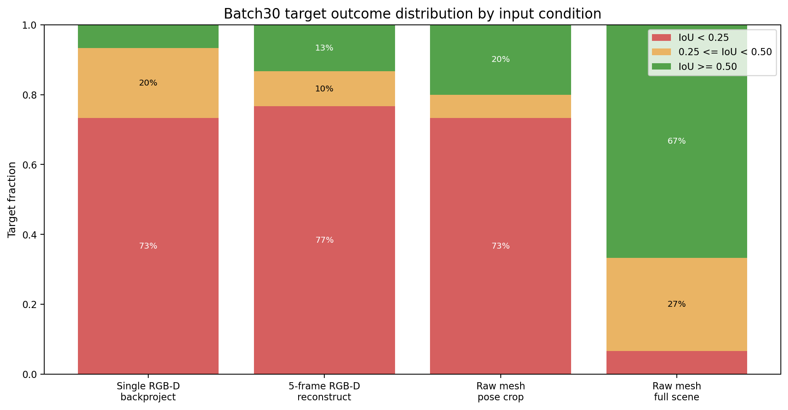

The full-scene detector has a very different outcome distribution from the partial point-cloud routes. For `scannet_full`, most targets reach at least IoU `0.25`, and two-thirds reach IoU `0.50`. For the single and multi-frame reconstructions, most targets remain below IoU `0.25`.

### Class-wise behavior

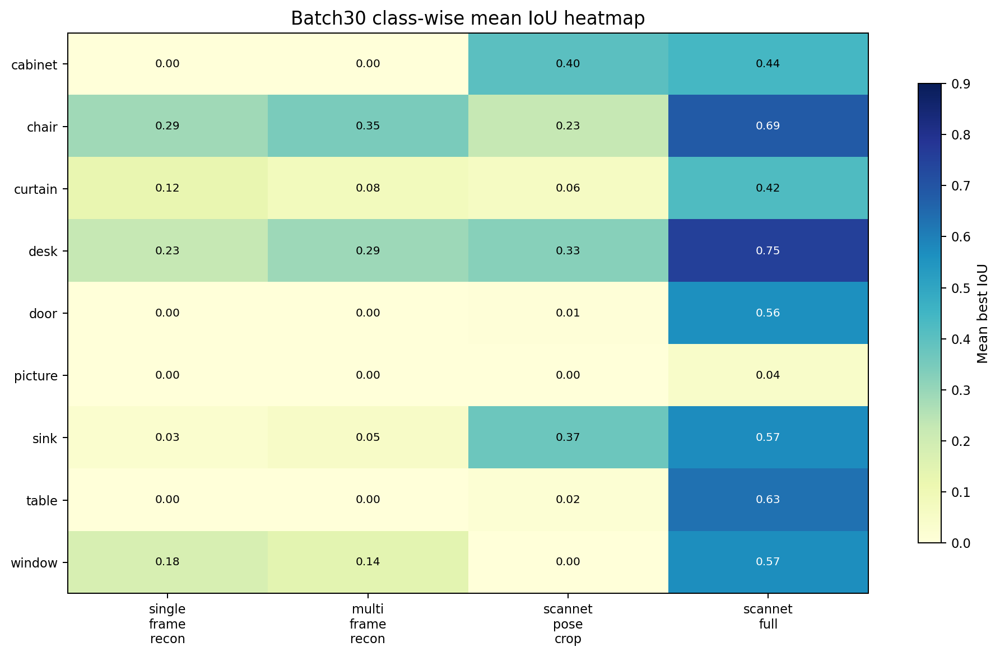

Class-level observations:

- `desk`, `chair`, `table`, `window`, `sink`, and `door` are strong under full-scene V-DETR.
- `picture` fails even in full-scene V-DETR in this batch.
- `curtain` has high loose overlap under full-scene V-DETR but lower strict localization.
- `cabinet` is mixed: some boxes work, but failures remain.
- Local crop and single/multi-frame routes do not consistently recover any broad class group.

Full-scene V-DETR class breakdown:

| Category | Count | Mean IoU | Acc@0.25 | Acc@0.50 |
|---|---:|---:|---:|---:|
| cabinet | 4 | 0.440 | 0.75 | 0.25 |
| chair | 3 | 0.685 | 1.00 | 1.00 |
| curtain | 6 | 0.424 | 1.00 | 0.17 |
| desk | 6 | 0.753 | 1.00 | 1.00 |
| door | 2 | 0.564 | 1.00 | 1.00 |
| picture | 1 | 0.045 | 0.00 | 0.00 |
| sink | 2 | 0.572 | 1.00 | 1.00 |
| table | 2 | 0.631 | 1.00 | 1.00 |
| window | 4 | 0.568 | 1.00 | 0.75 |

### Target-level view

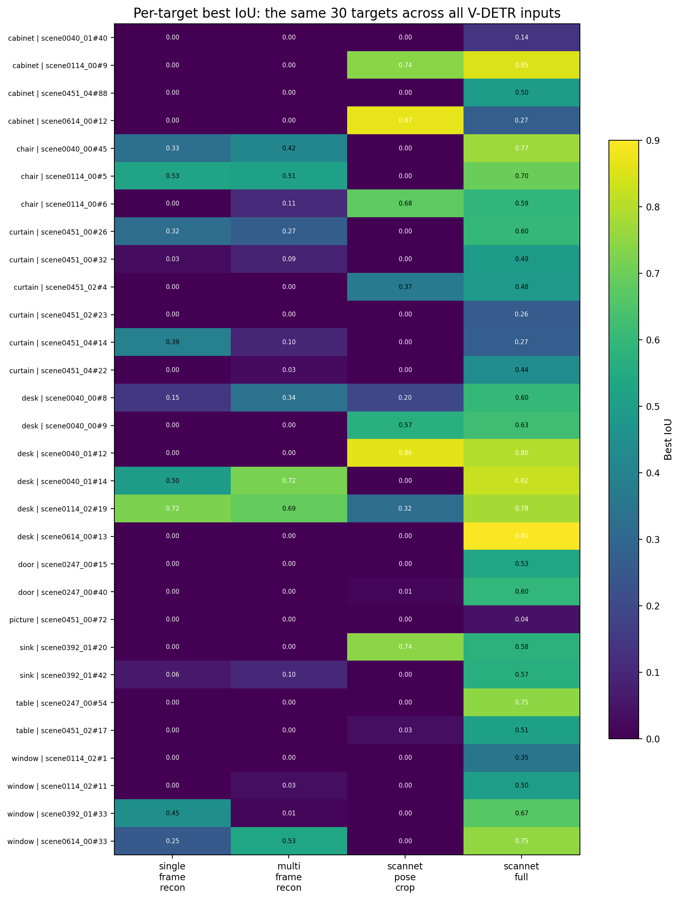

The target-level heatmap makes the distribution shift visible. Many targets have zero or near-zero IoU for single-frame and multi-frame V-DETR, while the same targets become detectable when the full ScanNet scene is used.

This supports the hypothesis that the detector is not generally incapable of detecting these objects. Instead, it is sensitive to the point-cloud input distribution.

### Visible-frame count is not enough

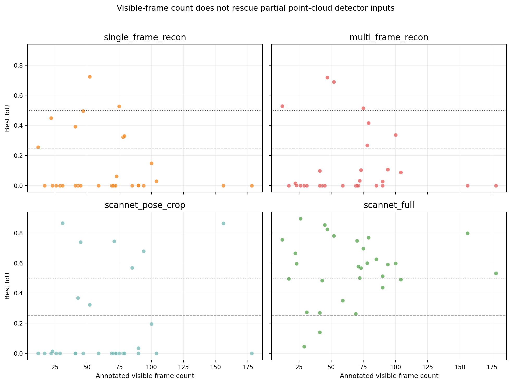

Some targets have many annotated visible frames but still fail under partial point-cloud detector inputs. The number of visible frames alone does not solve the problem if only one or a small local window is reconstructed. The relevant factor is not just whether the target appears in images; it is whether the input point cloud resembles a complete ScanNet scene with sufficient geometry and context.

## Point-cloud Input Visualization

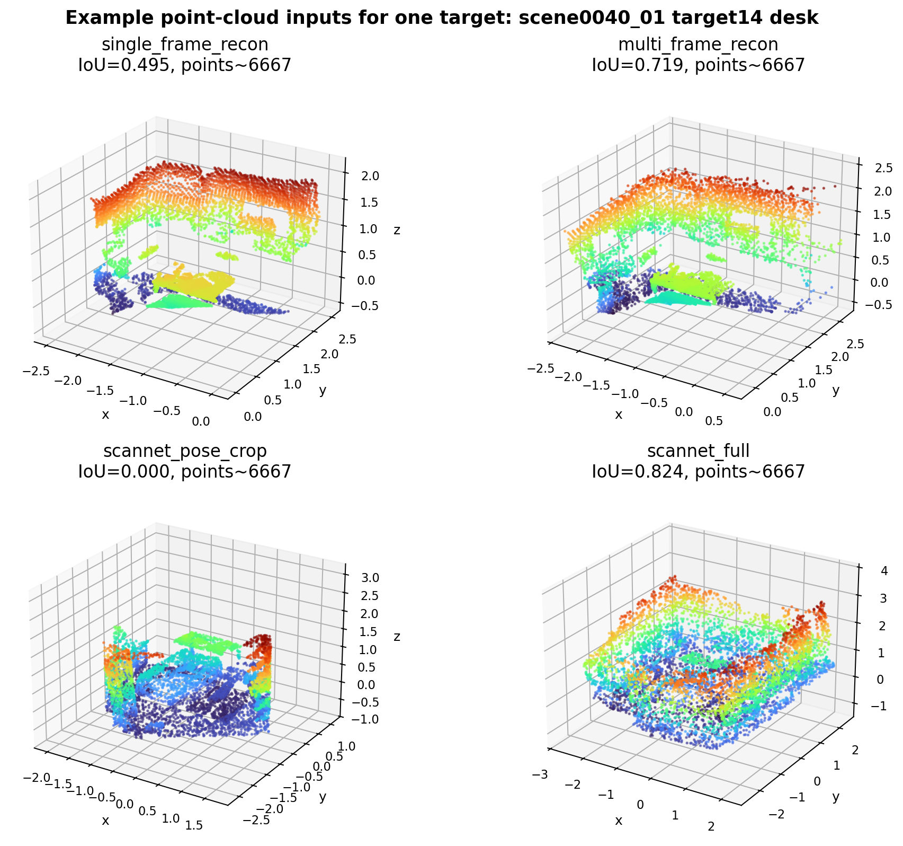

The example shows the same target under four point-cloud inputs:

- single-frame RGB-D backprojection
- 5-frame RGB-D reconstruction
- raw ScanNet mesh pose crop
- full raw ScanNet scene mesh

The full-scene input contains room layout, surrounding objects, and complete object extent cues. The single and local inputs are much more partial. This is exactly the kind of distribution difference a trained 3D detector can be sensitive to.

## Recommended System Design

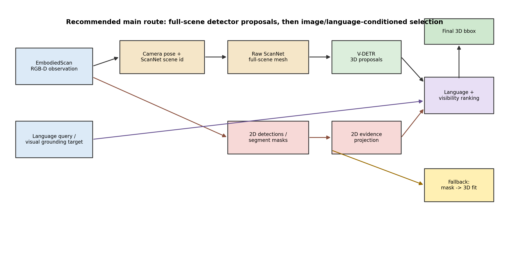

The recommended route is a hybrid system:

```text
1. Use pose / metadata to identify the ScanNet scene.
2. Run V-DETR once on the full raw ScanNet scene mesh.
3. Cache scene-level 3D proposals.
4. For each RGB-D visual grounding query:
   a. use camera pose to identify visible proposals
   b. project proposals back into the image if needed
   c. compare with 2D detection / segmentation evidence
   d. rank proposals using language and visual evidence
5. If the target is detector-OOD or no good proposal is visible:
   use 2D mask + depth/raw mesh points + geometric 3D bbox fitting.
```

This design separates proposal generation from target selection:

- V-DETR full-scene proposals solve the "good 3D boxes for known ScanNet-like objects" problem.
- 2D evidence solves "which proposal corresponds to this observation and phrase?"
- 2D-mask geometry handles objects that the closed-set 3D detector misses.

## Route Decision Tree

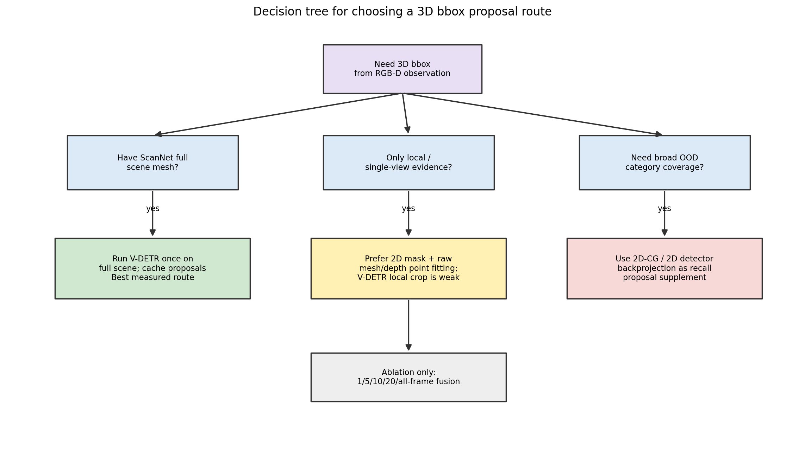

Practical decision rules:

1. If the ScanNet scene can be recovered and raw mesh is available, run full-scene V-DETR and cache the proposals.
2. If only a single image is available, do not run V-DETR on the single-frame backprojected point cloud as the main method.
3. If the target has a reliable 2D mask, use the mask to gather 3D points and fit a box.
4. If the object category is outside V-DETR's support, rely more heavily on 2D-CG / 2D mask backprojection.
5. Use local raw mesh crops as an ablation path, not as the current main route.

## Failure Taxonomy

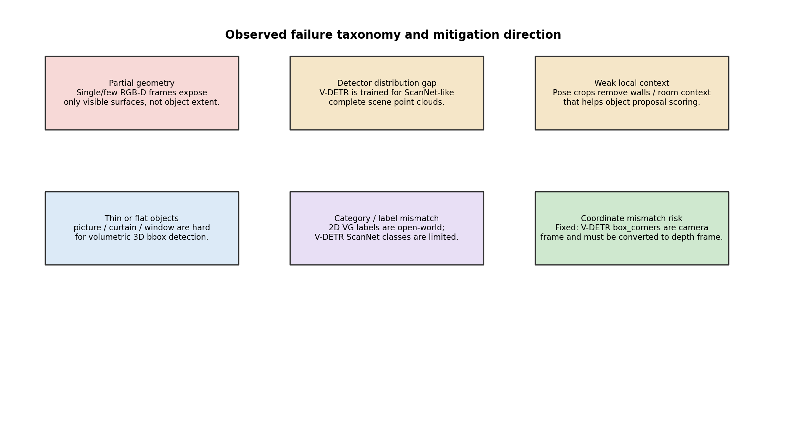

Observed or likely failure modes:

| Failure type | Affected route | Explanation | Mitigation |
|---|---|---|---|
| Partial geometry | single-frame, few-frame | only visible object surfaces are present | more frames, fusion, or direct geometric fitting |
| Detector distribution gap | single-frame, few-frame, local crop | V-DETR expects full ScanNet-like scenes | full-scene proposals; train/fine-tune on partial clouds if needed |
| Weak local context | pose crop | crop removes room and neighboring objects | larger context, exact frustum variants, or full scene |
| Thin / flat objects | picture, curtain, window | weak volumetric geometry and ambiguous extents | 2D mask projection; category-specific fitting |
| Category mismatch | open-world targets | V-DETR label set is limited | 2D-CG fallback and language matching |
| Coordinate mismatch | V-DETR export | box corners must be converted from camera to depth frame | fixed in exporter |

## Specific Answer: One Image Pose to Raw Scene Crop, Then 3D Detection

The user specifically asked:

```text
If we use one image's camera information to extract the corresponding part
from the original scene, the point quality should be much higher than RGB-D
reconstruction. How does 3D detection perform?
```

Current closest result:

```text
scannet_pose_crop:
mean IoU 0.1797
Acc@0.25 0.2667
Acc@0.50 0.2000
```

This is better than single-frame RGB-D backprojection at Acc@0.50:

```text
single_frame_recon:
mean IoU 0.1244
Acc@0.25 0.2667
Acc@0.50 0.0667
```

But it is still much weaker than full-scene raw mesh V-DETR:

```text
scannet_full:
mean IoU 0.5576
Acc@0.25 0.9333
Acc@0.50 0.6667
```

Interpretation:

Higher point quality helps, but it does not fully solve the problem. Local crop input still differs from V-DETR's training distribution because it lacks complete room context and may contain incomplete object extents. The detector is trained as a scene-level 3D detector, not as a single-view local crop detector.

The next clean experiment should be an exact frustum version:

```text
single image intrinsic + pose
project ScanNet mesh vertices into that image
keep only points inside the image frustum and valid depth range
optional variant: keep only points inside a 2D detection box or segmentation mask
compare V-DETR vs direct bbox fitting
```

Expected outcome:

- `frustum_full_image + V-DETR` may improve over current pose-bounds crop.
- `frustum_2d_mask + direct fitting` may be better than local-crop V-DETR for single-image settings.
- `full-scene V-DETR + 2D evidence selection` is still expected to be stronger as the main route.

## Proposed Next Experiments

### Experiment 1: Larger full-scene V-DETR sweep

Goal:

Validate whether full-scene V-DETR remains strong beyond 10 scenes / 30 targets.

Design:

- select 50 to 100 scenes
- keep V-DETR-supported classes
- run V-DETR once per scene
- evaluate all matching visible targets in those scenes

Expected value:

This turns the current batch30 evidence into a more statistically stable conclusion.

### Experiment 2: Exact single-image frustum crop

Goal:

Answer the one-image raw-scene crop question directly.

Design:

- for each selected RGB-D observation, project raw ScanNet mesh vertices into the camera
- retain points inside image bounds and valid depth range
- run V-DETR on the crop
- compare to current pose-bounds crop

Variants:

- full image frustum
- 2D bbox frustum
- segmentation mask frustum

### Experiment 3: Mask-guided geometric fitting

Goal:

Test whether a single image should bypass V-DETR and fit 3D boxes directly.

Design:

- use 2D detector / segmentation mask
- collect depth or raw mesh points corresponding to the mask
- remove outliers
- fit axis-aligned or oriented 3D bbox
- compare against V-DETR local-crop outputs

Expected value:

This may become the best single-image route.

### Experiment 4: RGB-D fusion ablation

Goal:

Determine whether RGB-D reconstruction can become detector-compatible with enough frames and better fusion.

Design:

- single frame
- 5 frames
- 10 frames
- 20 frames
- all visible frames
- optional TSDF / voxel fusion

Expected value:

This will separate "not enough frames" from "3D detector is fundamentally unsuitable for partial RGB-D reconstructions."

## Current Recommendation

The system should move forward with this hierarchy:

1. Primary proposal route:

```text
ScanNet full scene mesh -> V-DETR -> cached scene-level 3D proposals
```

2. Grounding / selection route:

```text
RGB-D observation + camera pose + 2D evidence + language -> select / rerank V-DETR proposals
```

3. Fallback route:

```text
2D mask -> depth/raw mesh points -> geometric 3D bbox fitting
```

4. Ablation-only route:

```text
single/few-frame RGB-D point cloud -> V-DETR
```

The key engineering direction is not to force every observation into a 3D detector. It is to use each source for what it is good at:

- full raw scene point cloud for strong 3D proposals
- RGB-D image evidence for visibility and grounding
- 2D segmentation for open-world object localization
- direct geometry for detector-OOD or single-image cases

## Qualitative RGB / Point Cloud Gallery

I added a full qualitative gallery for all 30 V-DETR batch targets:

- RGB observation view with projected GT, full-scene V-DETR, and 2D-CG boxes.
- Single-frame RGB-D point cloud with GT and best V-DETR proposal.
- 5-frame RGB-D point cloud with GT and best V-DETR proposal.
- Raw ScanNet pose-crop point cloud with GT and best V-DETR proposal.
- Full raw ScanNet scene point cloud with GT, best V-DETR proposal, and best 2D-CG proposal.

Color convention:

- green: GT bbox
- red: V-DETR best proposal
- blue: 2D-CG best proposal

The gallery is intentionally exhaustive rather than cherry-picked, so it includes success cases, partial successes, and clear failures.

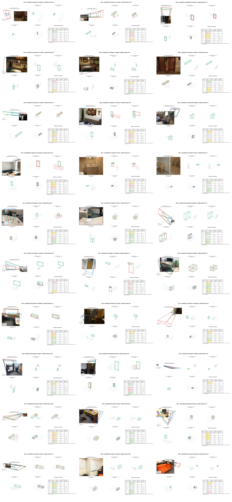

Detailed per-case gallery:

- [QUALITATIVE_GALLERY.md](QUALITATIVE_GALLERY.md)
- [qualitative_gallery.html](qualitative_gallery.html)
- [qualitative_cases.csv](resources/data/qualitative_cases.csv)
- [qualitative_case_manifest.json](resources/data/qualitative_case_manifest.json)

## Artifact Index

### Figures

- [01_overall_metrics_comparison.png](resources/figures/01_overall_metrics_comparison.png)
- [02_vdetr_condition_curves.png](resources/figures/02_vdetr_condition_curves.png)
- [03_class_breakdown_heatmap.png](resources/figures/03_class_breakdown_heatmap.png)
- [04_target_level_iou_heatmap.png](resources/figures/04_target_level_iou_heatmap.png)
- [05_success_distribution.png](resources/figures/05_success_distribution.png)
- [06_visible_frames_vs_iou.png](resources/figures/06_visible_frames_vs_iou.png)
- [07_recommended_pipeline.png](resources/figures/07_recommended_pipeline.png)
- [08_route_decision_tree.png](resources/figures/08_route_decision_tree.png)
- [09_failure_taxonomy.png](resources/figures/09_failure_taxonomy.png)
- [10_pointcloud_condition_example.png](resources/figures/10_pointcloud_condition_example.png)
- [11_vdetr_coordinate_fix.png](resources/figures/11_vdetr_coordinate_fix.png)
- [qualitative_contact_sheet.png](resources/qualitative/qualitative_contact_sheet.png)

### Data

- [metrics_overall.csv](resources/data/metrics_overall.csv)
- [batch30_scores.csv](resources/data/batch30_scores.csv)
- [batch30_scores_wide.csv](resources/data/batch30_scores_wide.csv)
- [batch30_class_breakdown.csv](resources/data/batch30_class_breakdown.csv)
- [report_summary.json](resources/data/report_summary.json)
- [resource_manifest.json](resources/data/resource_manifest.json)
- [qualitative_cases.csv](resources/data/qualitative_cases.csv)
- [qualitative_case_manifest.json](resources/data/qualitative_case_manifest.json)

### Dashboard

- [dashboard.html](dashboard.html)
- [qualitative_gallery.html](qualitative_gallery.html)
